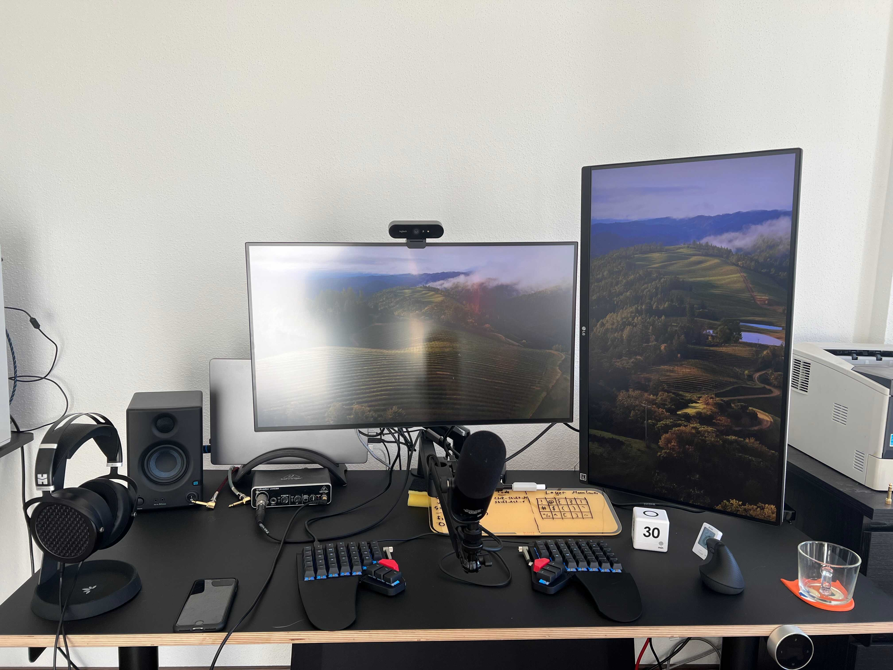

+++ 
date = 2024-01-01T14:33:44+01:00
title = "Dev Setup"
+++
I work exclusively from home as a software developer. This is my current development setup

## Hardware

    Apple M1 MacBook Pro and MacBook Air
    Dell U2723QE with USB-C Hub as main monitor
    LG 27UP650 as secondary monitor in vertical orientation
    Standing Desk from Eliot Furniture
    ZSA Moonlander split mechanical keyboard
    Logitech Lift vertical mouse
    Logitech Brio 4K Webcam
    Behringer UMC22 Audio Interface
    The t.bone BC500 microphone with Elgato low-profile microphone arm
    HifiMAN Sundara Headphones

I connect all of my USB devices to the main monitor. The monitor also has ethernet.

I recently made the move to a more ergonomic setup and I can really recommend using a vertical mouse and a split keyboard like the Moonlander, even though there is a bit of a learning curve.

My current layout for the Moonlander can be found [here](https://configure.zsa.io/moonlander/layouts/erlAE/BJRyD/0).

## Networking

    Router: AVM FRITZ!Box 4060
    Fiber Modem: Telekom Glasfaser Modem 2

I have a 1000 MBit/s optical fiber connection from german Telekom (Magenta) and I'm very happy with it. As usual in germany the link is asynchronous and "only" provides 200 MBit/s upload speeds, but it is still plenty for my uses.
The Fritz!Box supports Wifi 6, but I mostly connect my macbooks via ethernet (provided by my monitor).

## Editors

I use `Visual Studio Code` for all coding. I use the [vscodevim](https://github.com/VSCodeVim/Vim) plugin to enable VIM movements in VSCode. I use the [MonoLisa](https://www.monolisa.dev/) font and the [Monokai Charcoal High Contrast Theme](https://github.com/74th/vscode-monokaicharcoal).

## Fonts

MonoLisa. This is a paid font, but I find it really beautiful and I think it's worth it since I stare at this font many hours throughout the year(s).

## Terminal

I use kitty, fish, starship and some other tools.

You can find all of my dotfiles [here](https://github.com/pdstuber/dotfiles).